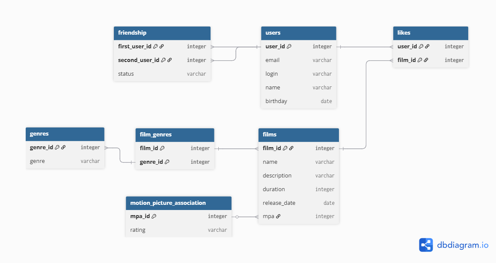

# java-filmorate


1. Получение всех фильмов
```
SELECT *
FROM films;
```
2. Получение всех пользователей
   
```
SELECT *
FROM users;
```
   
3. Топ 10 наиболее популярных фильмов

```
SELECT f.name,
       COUNT(l.film_id) AS film_likes
FROM films AS f
LEFT OUTER JOIN likes AS l ON l.film_id=f.film_id
GROUP BY f.name
ORDER BY film_likes DESC
LIMIT 10;
```

Template repository for Filmorate project.
